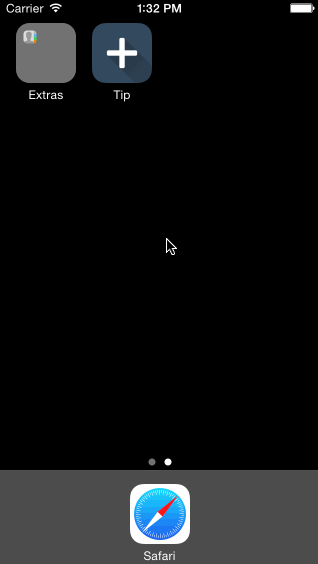
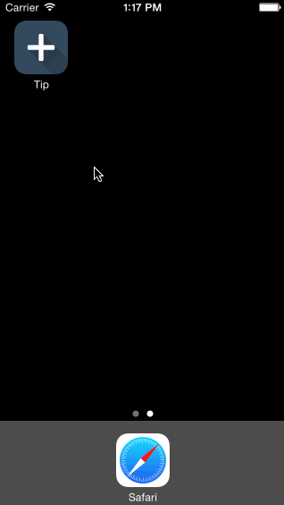

Tip
==================

Tip Calculator app for CodePath

Time spent: 15 hours total

Completed user stories:

* [x] Required: Basic tip calculator functionatliy
* [x] Required: Settings page
* [x] Optional: View animation
* [x] Optional: Remember the bill amount across app restarts (within 60 seconds)
* [x] Optional: Use locale specific currency and currency thousands separators
* [x] Optional: Light/dark color theme in settings view

**Walkthrough of required and optional user stories:**

**Walkthrough of locale specific currency (iOS7 simulator):**

GIF created with [LiceCap](http://www.cockos.com/licecap/).

Open-source libraries used:

[FontAwesome+iOS](https://github.com/alexdrone/ios-fontawesome)

[Font Awesome](http://fortawesome.github.io/Font-Awesome/)
